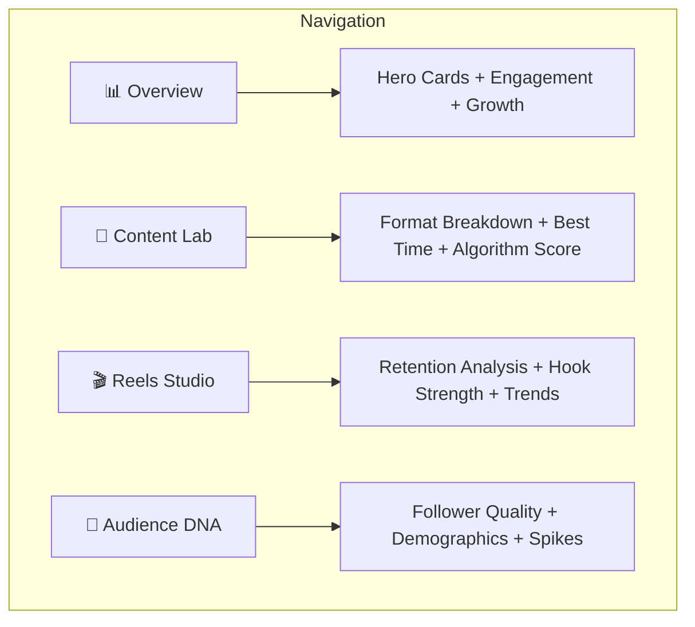

# Frontend Implementation Plan — Part 1
## Information Architecture + Navigation + Design System

> **Design philosophy:** Jakub Krehel (primary) for production polish + Emil Kowalski (secondary) for restraint on high-frequency dashboard interactions. Light pastel "Lumen" theme. Spring animations, `bounce: 0`, blur materializing enters.

---

## The Problem

All analytics currently live on `/dashboard` as a single long page. Adding 5 more Tier 1 feature sections would make it an overwhelming scroll. Content creators need **focused workspaces**, not a data dump.

## The Solution: 4 Purpose-Built Pages

Instead of cramming everything into one scroll, split into **mission-driven workspaces** that answer specific creator questions:



| Page | Route | Answers | BE Endpoints Used |
|------|-------|---------|-------------------|
| **Overview** | `/dashboard` | "How am I doing overall?" | Existing: overview, dashboard |
| **Content Lab** | `/dashboard/content` | "What content works best?" | format-breakdown, best-time, algorithm-metrics |
| **Reels Studio** | `/dashboard/reels` | "Are my hooks working?" | reels-retention, reels-retention/trend |
| **Audience DNA** | `/dashboard/audience` | "Who are my real fans?" | follower-quality, follower-quality/summary, follower-quality/spikes |

---

## Phase 1: Navigation Redesign

### Task 1.1 — Add Sidebar Navigation to DashboardLayout

Replace the flat Navbar links with a **sidebar + top bar** pattern. The sidebar uses framer-motion `layoutId` for the active tab indicator (Jakub's FLIP technique).

**File:** Create `src/components/DashboardSidebar.jsx`

```jsx
import { NavLink, useLocation } from "react-router-dom";
import { motion } from "framer-motion";
import { BarChart3, FlaskConical, Film, Users } from "lucide-react";

const NAV_ITEMS = [
  { to: "/dashboard",         icon: BarChart3,     label: "Overview" },
  { to: "/dashboard/content", icon: FlaskConical,  label: "Content Lab" },
  { to: "/dashboard/reels",   icon: Film,          label: "Reels Studio" },
  { to: "/dashboard/audience",icon: Users,          label: "Audience DNA" },
];

export default function DashboardSidebar() {
  const { pathname } = useLocation();

  return (
    <aside className="hidden lg:flex flex-col w-[220px] shrink-0 h-[calc(100dvh-56px)] sticky top-[56px] py-5 px-3 gap-1">
      {NAV_ITEMS.map(({ to, icon: Icon, label }) => {
        const isActive = pathname === to;
        return (
          <NavLink key={to} to={to} className="relative">
            {/* Animated active background — layoutId for FLIP */}
            {isActive && (
              <motion.div
                layoutId="sidebar-active"
                className="absolute inset-0 rounded-xl"
                style={{
                  background: "linear-gradient(135deg, rgba(139,92,246,0.10), rgba(236,72,153,0.06))",
                  border: "1px solid rgba(139,92,246,0.12)",
                }}
                transition={{ type: "spring", duration: 0.45, bounce: 0 }}
              />
            )}
            <div className={`relative flex items-center gap-3 px-3.5 py-2.5 rounded-xl text-sm font-medium transition-colors ${
              isActive ? "text-violet-700" : "text-slate-500 hover:text-slate-800 hover:bg-slate-50"
            }`}>
              <Icon size={18} strokeWidth={isActive ? 2.2 : 1.8} />
              <span>{label}</span>
            </div>
          </NavLink>
        );
      })}

      {/* Bottom section — subtle branding */}
      <div className="mt-auto px-3 pt-4 border-t border-slate-100">
        <p className="text-[11px] text-slate-400 font-medium tracking-wide">CREATOR OS</p>
      </div>
    </aside>
  );
}
```

### Task 1.2 — Update DashboardLayout

**File:** Modify `src/components/DashboardLayout.jsx`

```jsx
import Navbar from "./Navbar";
import DashboardSidebar from "./DashboardSidebar";

export default function DashboardLayout({ children }) {
  return (
    <div className="dashboard-root">
      <div className="dashboard-aurora" aria-hidden="true" />
      <Navbar />
      <div className="dashboard-content flex max-w-[1440px] mx-auto">
        <DashboardSidebar />
        <main className="flex-1 min-w-0 px-4 sm:px-6 lg:px-8 py-8">
          {children}
        </main>
      </div>
    </div>
  );
}
```

### Task 1.3 — Add Routes for New Pages

**File:** Modify `src/App.jsx`

```jsx
// New page imports
import ContentLabPage from "./pages/ContentLabPage";
import ReelsStudioPage from "./pages/ReelsStudioPage";
import AudienceDNAPage from "./pages/AudienceDNAPage";

// Inside <Routes>:
<Route path="/dashboard" element={<ProtectedRoute><DashboardPage /></ProtectedRoute>} />
<Route path="/dashboard/content" element={<ProtectedRoute><ContentLabPage /></ProtectedRoute>} />
<Route path="/dashboard/reels" element={<ProtectedRoute><ReelsStudioPage /></ProtectedRoute>} />
<Route path="/dashboard/audience" element={<ProtectedRoute><AudienceDNAPage /></ProtectedRoute>} />
```

---

## Phase 2: Shared Design Components

### Task 2.1 — AnimatedCard (Jakub's Enter Pattern)

Cards that materialize with blur + opacity + translateY. Used everywhere.

**File:** Create `src/components/shared/AnimatedCard.jsx`

```jsx
import { motion } from "framer-motion";

export default function AnimatedCard({
  children,
  delay = 0,
  className = "",
  onClick,
  hoverable = false,
  ...props
}) {
  return (
    <motion.div
      initial={{ opacity: 0, y: 8, filter: "blur(4px)" }}
      animate={{ opacity: 1, y: 0, filter: "blur(0px)" }}
      exit={{ opacity: 0, y: -6, filter: "blur(4px)" }}
      transition={{ type: "spring", duration: 0.45, bounce: 0, delay }}
      className={`d-card ${hoverable ? "cursor-pointer" : ""} ${className}`}
      onClick={onClick}
      whileHover={hoverable ? { y: -2, transition: { duration: 0.15 } } : undefined}
      whileTap={hoverable ? { scale: 0.985 } : undefined}
      {...props}
    >
      {children}
    </motion.div>
  );
}
```

### Task 2.2 — MetricPill (Animated Number Counter)

Smooth number counting animation + delta chip showing change.

**File:** Create `src/components/shared/MetricPill.jsx`

```jsx
import { useEffect, useRef, useState } from "react";
import { motion, useSpring, useTransform } from "framer-motion";
import { TrendingUp, TrendingDown, Minus } from "lucide-react";

function AnimatedNumber({ value, decimals = 0, suffix = "" }) {
  const spring = useSpring(0, { duration: 800, bounce: 0 });
  const display = useTransform(spring, (v) =>
    `${v.toFixed(decimals)}${suffix}`
  );
  const ref = useRef(null);

  useEffect(() => { spring.set(value); }, [value, spring]);

  return <motion.span ref={ref}>{display}</motion.span>;
}

export default function MetricPill({ label, value, delta, suffix = "", decimals = 0, color = "violet" }) {
  const deltaColor = delta > 0 ? "text-emerald-600" : delta < 0 ? "text-rose-500" : "text-slate-400";
  const DeltaIcon = delta > 0 ? TrendingUp : delta < 0 ? TrendingDown : Minus;

  return (
    <div className="flex flex-col gap-1">
      <span className="text-xs font-medium text-slate-500 uppercase tracking-wider">{label}</span>
      <span className="metric-value text-2xl">
        <AnimatedNumber value={value} decimals={decimals} suffix={suffix} />
      </span>
      {delta !== undefined && (
        <span className={`flex items-center gap-1 text-xs font-medium ${deltaColor}`}>
          <DeltaIcon size={12} />
          {Math.abs(delta).toFixed(1)}%
        </span>
      )}
    </div>
  );
}
```

### Task 2.3 — DrillDownChart Wrapper

A chart container that supports click-to-drill-down with animated transitions.

**File:** Create `src/components/shared/DrillDownChart.jsx`

```jsx
import { useState, useCallback } from "react";
import { motion, AnimatePresence } from "framer-motion";
import { ChevronLeft } from "lucide-react";

export default function DrillDownChart({
  title,
  subtitle,
  children,         // (drillState, onDrill) => ReactNode
  levels = [],      // ["Overview", "By Format", "By Post"]
  className = "",
}) {
  const [drillStack, setDrillStack] = useState([{ level: 0, context: null }]);
  const current = drillStack[drillStack.length - 1];

  const onDrill = useCallback((context) => {
    if (current.level < levels.length - 1) {
      setDrillStack((s) => [...s, { level: current.level + 1, context }]);
    }
  }, [current.level, levels.length]);

  const onBack = useCallback(() => {
    setDrillStack((s) => s.length > 1 ? s.slice(0, -1) : s);
  }, []);

  return (
    <div className={`d-card p-5 ${className}`}>
      {/* Header with breadcrumb */}
      <div className="flex items-center justify-between mb-4">
        <div className="flex items-center gap-2">
          {drillStack.length > 1 && (
            <motion.button
              initial={{ opacity: 0, x: -8 }}
              animate={{ opacity: 1, x: 0 }}
              exit={{ opacity: 0, x: -8 }}
              onClick={onBack}
              className="p-1 rounded-lg hover:bg-slate-100 text-slate-400 hover:text-slate-600 transition-colors"
            >
              <ChevronLeft size={18} />
            </motion.button>
          )}
          <div>
            <h3 className="text-sm font-semibold text-slate-800">{title}</h3>
            {subtitle && <p className="text-xs text-slate-500 mt-0.5">{subtitle}</p>}
          </div>
        </div>

        {/* Drill level indicator */}
        {levels.length > 1 && (
          <div className="flex items-center gap-1.5">
            {levels.map((l, i) => (
              <div key={l} className={`h-1.5 rounded-full transition-all duration-300 ${
                i <= current.level ? "w-5 bg-violet-400" : "w-1.5 bg-slate-200"
              }`} />
            ))}
          </div>
        )}
      </div>

      {/* Animated chart content */}
      <AnimatePresence mode="wait">
        <motion.div
          key={current.level + JSON.stringify(current.context)}
          initial={{ opacity: 0, y: 6, filter: "blur(3px)" }}
          animate={{ opacity: 1, y: 0, filter: "blur(0px)" }}
          exit={{ opacity: 0, y: -4, filter: "blur(3px)" }}
          transition={{ type: "spring", duration: 0.35, bounce: 0 }}
        >
          {children(current, onDrill)}
        </motion.div>
      </AnimatePresence>
    </div>
  );
}
```

### Task 2.4 — PageHeader Component

Consistent page title + period selector + description.

**File:** Create `src/components/shared/PageHeader.jsx`

```jsx
import { motion } from "framer-motion";
import PeriodSelector from "../dashboard/PeriodSelector";

export default function PageHeader({ title, subtitle, emoji, days, onDaysChange, actions }) {
  return (
    <motion.div
      initial={{ opacity: 0, y: 8, filter: "blur(4px)" }}
      animate={{ opacity: 1, y: 0, filter: "blur(0px)" }}
      transition={{ type: "spring", duration: 0.45, bounce: 0 }}
      className="flex flex-col sm:flex-row sm:items-center justify-between gap-4 mb-7"
    >
      <div>
        <h1 className="font-display text-3xl font-semibold text-slate-900 tracking-tight flex items-center gap-3">
          {emoji && <span className="text-2xl">{emoji}</span>}
          {title}
        </h1>
        {subtitle && (
          <p className="text-slate-500 text-[13px] mt-1.5 max-w-lg">{subtitle}</p>
        )}
      </div>
      <div className="flex items-center gap-3">
        {days !== undefined && <PeriodSelector days={days} onChange={onDaysChange} />}
        {actions}
      </div>
    </motion.div>
  );
}
```

### Task 2.5 — Skeleton Loader

Shimmer-effect loading placeholders that match card shapes.

**File:** Create `src/components/shared/Skeleton.jsx`

```jsx
export function SkeletonCard({ className = "", height = "h-48" }) {
  return (
    <div className={`d-card ${height} ${className} overflow-hidden relative`}>
      <div className="absolute inset-0 shimmer-line" />
    </div>
  );
}

export function SkeletonMetric() {
  return (
    <div className="flex flex-col gap-2 p-5">
      <div className="h-3 w-16 rounded bg-slate-100" />
      <div className="h-8 w-24 rounded bg-slate-100 shimmer-line" />
      <div className="h-3 w-12 rounded bg-slate-50" />
    </div>
  );
}

export function SkeletonChart({ height = "h-64" }) {
  return (
    <div className={`d-card p-5 ${height} flex flex-col`}>
      <div className="h-4 w-32 rounded bg-slate-100 mb-4" />
      <div className="flex-1 flex items-end gap-2 px-4 pb-4">
        {Array.from({ length: 12 }).map((_, i) => (
          <div
            key={i}
            className="flex-1 rounded-t bg-slate-50 shimmer-line"
            style={{ height: `${20 + Math.random() * 60}%` }}
          />
        ))}
      </div>
    </div>
  );
}
```

---

## Phase 3: New Hooks for Tier 1 Endpoints

### Task 3.1 — Add Tier 1 API Hooks

**File:** Create `src/hooks/useTier1Insights.js`

```jsx
import { useState, useEffect } from "react";
import api from "../api/client";

function useFetch(url, deps = []) {
  const [data, setData] = useState(null);
  const [loading, setLoading] = useState(true);
  const [error, setError] = useState(null);

  useEffect(() => {
    if (!url) return;
    setLoading(true);
    setError(null);
    api.get(url)
      .then((res) => setData(res.data))
      .catch((err) => setError(err.response?.data?.detail || "Request failed"))
      .finally(() => setLoading(false));
  }, [url, ...deps]);

  return { data, loading, error };
}

// Feature 1: Content Format Breakdown
export function useFormatBreakdown(days = 90) {
  return useFetch(`/instagram/insights/format-breakdown?days=${days}`, [days]);
}

// Feature 2: Best Time to Post
export function useBestTime(days = 90, minSample = 3) {
  return useFetch(`/instagram/insights/best-time?days=${days}&min_sample=${minSample}`, [days, minSample]);
}

// Feature 3: Algorithm / Save+Share Metrics
export function useAlgorithmMetrics(days = 30) {
  return useFetch(`/instagram/insights/algorithm-metrics?days=${days}`, [days]);
}

export function useAlgorithmPosts(days = 30, limit = 20) {
  return useFetch(`/instagram/insights/algorithm-metrics/posts?days=${days}&limit=${limit}`, [days, limit]);
}

// Feature 4: Reels Retention
export function useReelsRetention(days = 90, limit = 50) {
  return useFetch(`/instagram/insights/reels-retention?days=${days}&limit=${limit}`, [days, limit]);
}

export function useReelsTrend(days = 180) {
  return useFetch(`/instagram/insights/reels-retention/trend?days=${days}`, [days]);
}

// Feature 5: Follower Quality
export function useFollowerQuality(breakdown = "age") {
  return useFetch(`/instagram/insights/follower-quality?breakdown=${breakdown}`, [breakdown]);
}

export function useFollowerQualitySummary(breakdown = "age") {
  return useFetch(`/instagram/insights/follower-quality/summary?breakdown=${breakdown}`, [breakdown]);
}

export function useFollowerSpikes(days = 90, threshold = 50) {
  return useFetch(`/instagram/insights/follower-quality/spikes?days=${days}&threshold=${threshold}`, [days, threshold]);
}
```

---

## Phase 3 Checklist

| # | Task | File | Status |
|---|------|------|--------|
| 1.1 | Create DashboardSidebar | `components/DashboardSidebar.jsx` | ⬜ |
| 1.2 | Update DashboardLayout | `components/DashboardLayout.jsx` | ⬜ |
| 1.3 | Add routes for new pages | `App.jsx` | ⬜ |
| 2.1 | Create AnimatedCard | `components/shared/AnimatedCard.jsx` | ⬜ |
| 2.2 | Create MetricPill | `components/shared/MetricPill.jsx` | ⬜ |
| 2.3 | Create DrillDownChart | `components/shared/DrillDownChart.jsx` | ⬜ |
| 2.4 | Create PageHeader | `components/shared/PageHeader.jsx` | ⬜ |
| 2.5 | Create Skeleton loaders | `components/shared/Skeleton.jsx` | ⬜ |
| 3.1 | Create Tier 1 hooks | `hooks/useTier1Insights.js` | ⬜ |

---

## Motion Design Rules for This Project

Based on the design-motion-principles skill (Jakub primary, Emil secondary):

| Element | Duration | Easing | Properties |
|---------|----------|--------|------------|
| Card enter | 450ms | spring, bounce: 0 | opacity + y(8px) + blur(4px) |
| Card exit | 350ms | spring, bounce: 0 | opacity + y(-6px) + blur(4px) |
| Tab switch (layoutId) | 450ms | spring, bounce: 0 | auto FLIP |
| Chart drill-down | 350ms | spring, bounce: 0 | opacity + y(6px) + blur(3px) |
| Hover lift | 150ms | ease | y(-2px) + shadow |
| Number counter | 800ms | spring, bounce: 0 | value interpolation |
| Skeleton shimmer | 2400ms | linear | background-position |
| Button tap | instant | — | scale(0.985) |

**Accessibility:** All animations wrapped in `prefers-reduced-motion: reduce` media query (already in `index.css` line 390).
