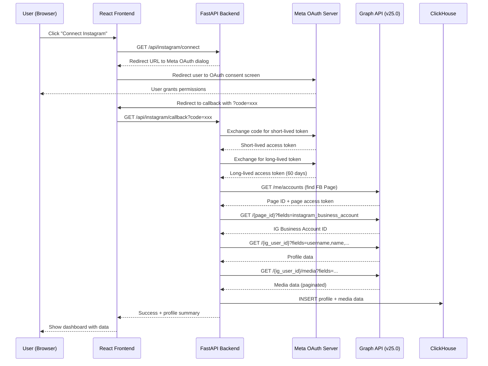
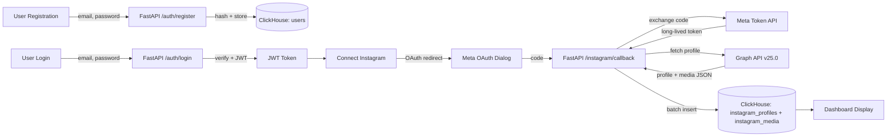

# Instagram Analytics Dashboard — Implementation Plan

## Overview

Build an analytics dashboard for Instagram content creators that allows users to **register/login**, **connect their Instagram Business/Creator account** via the Meta OAuth flow, and **fetch + store profile & media data** in ClickHouse.

---

## Tech Stack & Versions

| Layer | Technology | Version |
|---|---|---|
| **Backend** | FastAPI | 0.136.x (latest) |
| **Frontend** | React (Vite) | 19.x (latest) |
| **PWA** | vite-plugin-pwa | latest |
| **Styling** | Tailwind CSS | v4.2.x (CSS-first config) |
| **Database** | ClickHouse Cloud | via `clickhouse-connect` |
| **Migrations** | clickhouse-migrations | latest |
| **Instagram API** | Instagram Graph API | **v25.0** (latest) |
| **Auth** | JWT (python-jose + passlib[bcrypt]) | — |

---

## User Review Required

> [!IMPORTANT]
> **ClickHouse Credentials Mapping** — You provided a `Key ID` and `Key Secret`. The plan assumes these map to ClickHouse Cloud API credentials where `Key ID` → username and `Key Secret` → password, connecting over HTTPS (port 8443). Please confirm your **ClickHouse Cloud hostname** (e.g., `abc123.clickhouse.cloud`) and the **database name** you want to use.

> [!IMPORTANT]
> **Meta App Credentials Required** — To use the Instagram Graph API, you need a **Meta (Facebook) App** registered at [developers.facebook.com](https://developers.facebook.com/). Please provide or create:
> 1. **Facebook App ID**
> 2. **Facebook App Secret**
> 3. The Instagram account must be a **Business** or **Creator** account linked to a Facebook Page.

> [!WARNING]
> **Credentials in Code** — The provided ClickHouse credentials will be stored in a `.env` file (gitignored). They should **never** be committed to version control.

---

## Open Questions

> [!IMPORTANT]
> 1. **ClickHouse Host**: What is your ClickHouse Cloud hostname? (e.g., `xxxx.clickhouse.cloud`)
> 2. **Database Name**: What database name should be used? (e.g., `social_analytics`)
> 3. **Meta App**: Do you already have a Meta Developer App created? If not, we'll include setup instructions.
> 4. **Domain/Port**: What port should the frontend dev server run on? (default: `5173`). Backend? (default: `8000`).
> 5. **Tailwind CSS Version**: You requested Tailwind — confirming you want **v4.x** (the latest major, CSS-first configuration). The plan proceeds with v4.

---

## Project Structure

```
c:\laragon\www\social-analitic\
├── backend/                          # FastAPI application
│   ├── app/
│   │   ├── __init__.py
│   │   ├── main.py                   # FastAPI app entry point
│   │   ├── config.py                 # Pydantic Settings (.env loader)
│   │   ├── database.py               # ClickHouse client singleton
│   │   ├── auth/
│   │   │   ├── __init__.py
│   │   │   ├── router.py             # /auth/register, /auth/login
│   │   │   ├── schemas.py            # Pydantic models for auth
│   │   │   ├── service.py            # Password hashing, JWT creation
│   │   │   └── dependencies.py       # get_current_user dependency
│   │   ├── instagram/
│   │   │   ├── __init__.py
│   │   │   ├── router.py             # /instagram/connect, /instagram/callback, /instagram/profile
│   │   │   ├── schemas.py            # Pydantic models for IG data
│   │   │   └── service.py            # Graph API client logic
│   │   └── models/
│   │       ├── __init__.py
│   │       └── queries.py            # Raw SQL queries for ClickHouse
│   ├── migrations/                   # clickhouse-migrations SQL files
│   │   ├── 001_create_users.sql
│   │   ├── 002_create_instagram_profiles.sql
│   │   └── 003_create_instagram_media.sql
│   ├── requirements.txt
│   ├── .env                          # Environment variables (gitignored)
│   └── .env.example                  # Template for env vars
├── frontend/                         # React PWA (Vite)
│   ├── public/
│   │   ├── pwa-192x192.png
│   │   ├── pwa-512x512.png
│   │   └── favicon.svg
│   ├── src/
│   │   ├── main.jsx
│   │   ├── App.jsx
│   │   ├── index.css                 # Tailwind v4 entry (@import "tailwindcss")
│   │   ├── api/
│   │   │   └── client.js             # Axios/fetch wrapper with JWT interceptor
│   │   ├── context/
│   │   │   └── AuthContext.jsx        # React Context for auth state
│   │   ├── pages/
│   │   │   ├── LoginPage.jsx
│   │   │   ├── RegisterPage.jsx
│   │   │   ├── DashboardPage.jsx      # Main dashboard after IG connect
│   │   │   ├── ConnectInstagramPage.jsx # Initiates Meta OAuth
│   │   │   └── CallbackPage.jsx       # Handles OAuth redirect
│   │   ├── components/
│   │   │   ├── Layout.jsx
│   │   │   ├── Navbar.jsx
│   │   │   ├── ProfileCard.jsx        # Shows IG profile info
│   │   │   ├── MediaGrid.jsx          # Grid of IG media posts
│   │   │   ├── MediaCard.jsx          # Individual media card
│   │   │   └── StatsOverview.jsx      # Followers, following, media count
│   │   └── hooks/
│   │       └── useAuth.js
│   ├── vite.config.js
│   ├── package.json
│   └── index.html
├── .gitignore
└── README.md
```

---

## Proposed Changes

### Component 1: Database Layer (ClickHouse + Migrations)

#### [NEW] [001_create_users.sql](file:///c:/laragon/www/social-analitic/backend/migrations/001_create_users.sql)

```sql
CREATE TABLE IF NOT EXISTS users (
    id UUID DEFAULT generateUUIDv4(),
    email String,
    username String,
    hashed_password String,
    is_active UInt8 DEFAULT 1,
    created_at DateTime DEFAULT now(),
    updated_at DateTime DEFAULT now()
) ENGINE = ReplacingMergeTree(updated_at)
ORDER BY (id)
SETTINGS index_granularity = 8192;

-- Secondary index for email lookups
ALTER TABLE users ADD INDEX idx_email (email) TYPE bloom_filter GRANULARITY 1;
```

#### [NEW] [002_create_instagram_profiles.sql](file:///c:/laragon/www/social-analitic/backend/migrations/002_create_instagram_profiles.sql)

```sql
CREATE TABLE IF NOT EXISTS instagram_profiles (
    id UUID DEFAULT generateUUIDv4(),
    user_id UUID,                          -- FK to users table
    ig_user_id String,                     -- Instagram Graph API user ID
    username String,
    name String,
    biography String,
    profile_picture_url String,
    followers_count UInt64 DEFAULT 0,
    follows_count UInt64 DEFAULT 0,
    media_count UInt64 DEFAULT 0,
    access_token String,                   -- Long-lived access token (encrypted)
    token_expires_at DateTime,
    connected_at DateTime DEFAULT now(),
    updated_at DateTime DEFAULT now()
) ENGINE = ReplacingMergeTree(updated_at)
ORDER BY (user_id, ig_user_id)
SETTINGS index_granularity = 8192;
```

#### [NEW] [003_create_instagram_media.sql](file:///c:/laragon/www/social-analitic/backend/migrations/003_create_instagram_media.sql)

```sql
CREATE TABLE IF NOT EXISTS instagram_media (
    id UUID DEFAULT generateUUIDv4(),
    ig_media_id String,                    -- Instagram media ID
    ig_user_id String,                     -- Instagram user who owns it
    user_id UUID,                          -- FK to users table
    media_type String,                     -- IMAGE, VIDEO, CAROUSEL_ALBUM
    media_url String,
    thumbnail_url String DEFAULT '',
    permalink String,
    caption String DEFAULT '',
    timestamp DateTime,
    like_count UInt64 DEFAULT 0,
    comments_count UInt64 DEFAULT 0,
    fetched_at DateTime DEFAULT now()
) ENGINE = ReplacingMergeTree(fetched_at)
ORDER BY (user_id, ig_user_id, ig_media_id)
SETTINGS index_granularity = 8192;
```

#### [NEW] [database.py](file:///c:/laragon/www/social-analitic/backend/app/database.py)

- Initialize `clickhouse_connect.get_client()` with Cloud credentials from `.env`
- Provide a reusable `get_client()` dependency for FastAPI routes
- Connection params: `host`, `port=8443`, `username=KEY_ID`, `password=KEY_SECRET`, `secure=True`

---

### Component 2: Backend — Authentication (FastAPI + JWT)

#### [NEW] [config.py](file:///c:/laragon/www/social-analitic/backend/app/config.py)

- Use `pydantic-settings` `BaseSettings` to load from `.env`:
  - `CLICKHOUSE_HOST`, `CLICKHOUSE_PORT`, `CLICKHOUSE_USER`, `CLICKHOUSE_PASSWORD`, `CLICKHOUSE_DATABASE`
  - `JWT_SECRET_KEY`, `JWT_ALGORITHM=HS256`, `JWT_EXPIRATION_MINUTES=1440`
  - `META_APP_ID`, `META_APP_SECRET`, `META_REDIRECT_URI`
  - `FRONTEND_URL` (for CORS)

#### [NEW] [auth/router.py](file:///c:/laragon/www/social-analitic/backend/app/auth/router.py)

| Endpoint | Method | Description |
|---|---|---|
| `/api/auth/register` | POST | Register new user (email, username, password) |
| `/api/auth/login` | POST | Login with email + password → returns JWT |
| `/api/auth/me` | GET | Get current user profile (protected) |

- Passwords hashed with `passlib[bcrypt]`
- JWT tokens created with `python-jose` (HS256)
- User stored in ClickHouse `users` table
- Email uniqueness checked before registration

#### [NEW] [auth/schemas.py](file:///c:/laragon/www/social-analitic/backend/app/auth/schemas.py)

```python
class UserRegister(BaseModel):
    email: EmailStr
    username: str
    password: str  # min 8 chars

class UserLogin(BaseModel):
    email: EmailStr
    password: str

class UserResponse(BaseModel):
    id: str
    email: str
    username: str
    is_active: bool

class TokenResponse(BaseModel):
    access_token: str
    token_type: str = "bearer"
```

#### [NEW] [auth/dependencies.py](file:///c:/laragon/www/social-analitic/backend/app/auth/dependencies.py)

- `get_current_user()` — extracts JWT from `Authorization: Bearer <token>`, decodes it, fetches user from ClickHouse

---

### Component 3: Backend — Instagram Graph API Integration

The Instagram Graph API integration follows Meta's standard OAuth 2.0 flow:



#### [NEW] [instagram/router.py](file:///c:/laragon/www/social-analitic/backend/app/instagram/router.py)

| Endpoint | Method | Description |
|---|---|---|
| `/api/instagram/connect` | GET | Returns Meta OAuth URL for frontend redirect |
| `/api/instagram/callback` | GET | Handles OAuth callback, exchanges code for token, fetches data |
| `/api/instagram/profile` | GET | Returns stored IG profile for current user |
| `/api/instagram/media` | GET | Returns stored IG media for current user (paginated) |
| `/api/instagram/refresh` | POST | Re-fetches latest data from Graph API and updates ClickHouse |

#### [NEW] [instagram/service.py](file:///c:/laragon/www/social-analitic/backend/app/instagram/service.py)

Core functions:
1. **`get_oauth_url()`** — Constructs Meta OAuth dialog URL with required scopes:
   - `instagram_basic`, `pages_show_list`, `pages_read_engagement`, `instagram_manage_insights`
2. **`exchange_code_for_token(code)`** — POST to `graph.facebook.com/v25.0/oauth/access_token`
3. **`get_long_lived_token(short_token)`** — Exchange short-lived → long-lived (60 days)
4. **`get_instagram_business_account(token)`** — Discover IG Business Account ID via `/me/accounts` → `instagram_business_account`
5. **`fetch_profile(ig_user_id, token)`** — GET `/{ig_user_id}?fields=username,name,biography,profile_picture_url,followers_count,follows_count,media_count`
6. **`fetch_media(ig_user_id, token)`** — GET `/{ig_user_id}/media?fields=id,media_type,media_url,thumbnail_url,permalink,caption,timestamp,like_count,comments_count` with pagination handling
7. **`store_profile(user_id, profile_data)`** — INSERT/UPDATE into `instagram_profiles`
8. **`store_media(user_id, media_list)`** — Batch INSERT into `instagram_media`

---

### Component 4: Backend — Main App & Configuration

#### [NEW] [main.py](file:///c:/laragon/www/social-analitic/backend/app/main.py)

- Create FastAPI app with CORS middleware (allow frontend origin)
- Include `auth.router` and `instagram.router`
- Health check endpoint at `/api/health`
- Startup event: verify ClickHouse connection

#### [NEW] [requirements.txt](file:///c:/laragon/www/social-analitic/backend/requirements.txt)

```
fastapi[standard]>=0.136.0
uvicorn[standard]>=0.34.0
python-jose[cryptography]>=3.3.0
passlib[bcrypt]>=1.7.4
pydantic[email]>=2.0
pydantic-settings>=2.0
clickhouse-connect>=0.8.0
clickhouse-migrations>=0.4.0
httpx>=0.28.0
python-multipart>=0.0.18
python-dotenv>=1.0.0
```

#### [NEW] [.env.example](file:///c:/laragon/www/social-analitic/backend/.env.example)

```env
# ClickHouse Cloud
CLICKHOUSE_HOST=your-host.clickhouse.cloud
CLICKHOUSE_PORT=8443
CLICKHOUSE_USER=kxV2b47XUYT566x6pXkZ
CLICKHOUSE_PASSWORD=4b1docFTjiVukt0YOdykEvc1IRLI8DlDAb1ULWJOop
CLICKHOUSE_DATABASE=social_analytics

# JWT
JWT_SECRET_KEY=your-super-secret-key-change-this
JWT_ALGORITHM=HS256
JWT_EXPIRATION_MINUTES=1440

# Meta / Instagram
META_APP_ID=your-facebook-app-id
META_APP_SECRET=your-facebook-app-secret
META_REDIRECT_URI=http://localhost:5173/callback

# Frontend
FRONTEND_URL=http://localhost:5173
```

---

### Component 5: Frontend — React PWA (Vite + Tailwind v4)

#### [NEW] Vite Project Initialization

```bash
npm create vite@latest ./ -- --template react
npm install
npm install vite-plugin-pwa -D
npm install react-router-dom axios
npx @tailwindcss/cli init   # Tailwind v4 setup
```

#### [NEW] [vite.config.js](file:///c:/laragon/www/social-analitic/frontend/vite.config.js)

- Configure `VitePWA` plugin with:
  - `registerType: 'autoUpdate'`
  - App manifest (name, icons, theme color, background color)
  - Workbox runtime caching for API responses
- Configure proxy to backend for development (`/api` → `http://localhost:8000`)

#### [NEW] [index.css](file:///c:/laragon/www/social-analitic/frontend/src/index.css)

```css
@import "tailwindcss";

/* Tailwind v4 CSS-first theme configuration */
@theme {
  --color-primary: oklch(0.65 0.25 275);        /* Vibrant purple-blue */
  --color-primary-light: oklch(0.75 0.20 275);
  --color-primary-dark: oklch(0.50 0.25 275);
  --color-accent: oklch(0.75 0.20 330);          /* Pink accent */
  --color-surface: oklch(0.15 0.02 275);         /* Dark surface */
  --color-surface-elevated: oklch(0.20 0.02 275);
  --color-text: oklch(0.95 0.01 275);
  --color-text-muted: oklch(0.70 0.02 275);
  --color-success: oklch(0.72 0.20 150);
  --color-danger: oklch(0.65 0.25 25);

  --font-sans: 'Inter', system-ui, sans-serif;

  --radius-card: 1rem;
  --shadow-glow: 0 0 30px oklch(0.65 0.25 275 / 0.15);
}
```

#### [NEW] Page Components

| Page | Route | Description |
|---|---|---|
| `LoginPage` | `/login` | Email + password form, JWT stored in httpOnly cookie or context |
| `RegisterPage` | `/register` | Registration form (email, username, password) |
| `ConnectInstagramPage` | `/connect` | "Connect Instagram" button → redirects to Meta OAuth |
| `CallbackPage` | `/callback` | Receives OAuth `?code=`, sends to backend, redirects to dashboard |
| `DashboardPage` | `/dashboard` | Shows profile card, stats, media grid |

#### [NEW] UI Components (Premium Design)

- **`Layout.jsx`** — Dark-mode shell with glassmorphism sidebar/navbar
- **`Navbar.jsx`** — Top nav with user avatar, gradient accent border
- **`ProfileCard.jsx`** — Instagram profile picture, name, bio with frosted glass background
- **`StatsOverview.jsx`** — Animated counter cards for followers, following, posts with gradient backgrounds
- **`MediaGrid.jsx`** — Responsive masonry/grid of Instagram posts with hover effects
- **`MediaCard.jsx`** — Individual media card with image, caption preview, like/comment counts, subtle scale animation on hover

#### Design System

- **Dark mode by default** with deep purple-black backgrounds
- **Glassmorphism** cards with `backdrop-blur` and subtle borders
- **Gradient accents** (purple → pink) for buttons and highlights
- **Inter font** from Google Fonts
- **Micro-animations**: hover scale, fade-in on mount, animated number counters
- **Instagram-inspired** gradient accents on the profile card border

---

### Component 6: PWA Configuration

#### [NEW] PWA Manifest & Service Worker

- **App Name**: "Social Analytics"
- **Short Name**: "SocialAI"
- **Theme Color**: Deep purple (`#1a1025`)
- **Icons**: Generated 192x192 and 512x512 PNG icons
- **Offline Support**: Cache-first for static assets, network-first for API
- **Installable**: Full PWA manifest for Add to Home Screen

---

## Data Flow Summary



---

## Verification Plan

### Automated Tests

1. **Backend startup**: `uvicorn app.main:app --reload` — verify no import errors
2. **ClickHouse connectivity**: Hit `/api/health` endpoint to confirm DB connection
3. **Migration test**: Run `clickhouse-migrations` CLI against the Cloud instance
4. **Auth flow**:
   - `POST /api/auth/register` with test credentials → 201
   - `POST /api/auth/login` with same credentials → 200 + JWT
   - `GET /api/auth/me` with JWT header → 200 + user data
5. **Instagram flow** (requires Meta App credentials):
   - `GET /api/instagram/connect` → returns valid OAuth URL
   - Complete OAuth in browser → callback stores data
   - `GET /api/instagram/profile` → returns stored profile
   - `GET /api/instagram/media` → returns stored media

### Manual Verification

1. **Frontend**: Open `http://localhost:5173` → verify dark-mode UI renders
2. **PWA**: Build production → check Chrome DevTools > Application tab for service worker + manifest
3. **OAuth**: Full end-to-end test with a real Instagram Business/Creator account
4. **Responsive**: Test on mobile viewport sizes (375px, 768px, 1024px)

### Browser Testing

- Navigate through register → login → connect Instagram → dashboard flow
- Verify all animations and transitions are smooth
- Check PWA installability in Chrome

---

## Execution Order

1. **Phase 1**: Project scaffolding (directories, configs, `.env`, `.gitignore`)
2. **Phase 2**: ClickHouse migrations (create tables)
3. **Phase 3**: Backend auth module (register, login, JWT)
4. **Phase 4**: Backend Instagram module (OAuth, token exchange, data fetch)
5. **Phase 5**: Frontend scaffolding (Vite + React + Tailwind v4 + PWA)
6. **Phase 6**: Frontend auth pages (login, register)
7. **Phase 7**: Frontend Instagram connect + callback
8. **Phase 8**: Frontend dashboard (profile card, stats, media grid)
9. **Phase 9**: Polish, animations, responsive design, final testing
