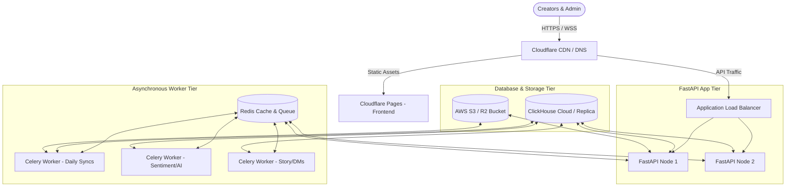

# InfluenceIQ — Product Roadmap (Part 4 of 4)
# Production Deployment, Scaling & Compliance Strategy

---

## 🏗️ Production Infrastructure Architecture

To support 1,000+ creators (with over 1.3 million daily requests and background operations running concurrently), the infrastructure must move from a single-instance development setup to a decoupled, resilient, and secure production architecture.

### Infrastructure Components & Roles

1. **Frontend Hosting (Cloudflare Pages)**
   - Serves the compiled Vite + React 19 Single Page Application (SPA).
   - Global CDN distribution reduces Time to First Byte (TTFB) to near zero.
   - Cost: **$0** (Free tier is extremely generous for static hosting).

2. **Application Load Balancer (ALB)**
   - Nginx or AWS ALB performing SSL/TLS termination and distributing incoming API requests.
   - Handles path routing (`/api/v1/*` directed to FastAPI, static routing to assets if not using Pages).

3. **FastAPI Application Nodes (2 × Web VPS nodes)**
   - Runs the stateless backend API servers using Uvicorn.
   - Redundancy: 2 nodes ensure zero-downtime rolling updates and high availability if one instance fails.

4. **Redis Cache & Message Broker (1 × Managed VPS)**
   - Serves as the message broker for Celery background workers.
   - Stores rate-limiting counters, active session tokens, and cached API responses (like temporary competitor summaries).

5. **Celery Worker Tier (2 × Worker VPS nodes)**
   - Dedicated servers running Celery background worker processes.
   - Split queues:
     - `high_priority`: Real-time DM automations, golden hour post checks, user-initiated refreshes.
     - `default`: Scheduled daily syncs, sentiment batching, keyword monitoring.
     - `heavy`: Weekly comment topic clustering, historical archive parsing.

6. **ClickHouse Columnar Database**
   - ClickHouse Cloud (Scale Tier) or self-hosted ClickHouse cluster.
   - Handles multi-million row analytics, time-series data, and text sentiment lookups.

7. **Object Storage (AWS S3 / Cloudflare R2)**
   - Stores user-uploaded profile assets, generated PDF media kits, and raw archive JSON files imported by creators.

---

## ⚡ Scaling Strategies for 1,000+ Creators

### 1. ClickHouse Optimization

With 1,000 users storing millions of comments and performance metrics, clickhouse performance is preserved through database-level design patterns:

*   **ReplacingMergeTree for Idempotent Syncs:**
    Daily updates can fetch the same media items multiple times. By using `ReplacingMergeTree(ver)` sorted by `(user_id, media_id, timestamp)`, clickhouse automatically deduplicates entries in the background during merges, avoiding duplicate storage and double-counting.
*   **Partition Pruning:**
    Large tables (like `comments` and `media_insights`) are partitioned by `toYYYYMM(timestamp)`. Queries containing date-range filters only scan matching monthly partitions, reducing read times from seconds to milliseconds.
*   **Buffer Tables for High-Volume Writes:**
    Real-time comment syncs and webhooks perform many small inserts. Inserting directly into ClickHouse is slow. A `Buffer` table engine collects comment insertions in RAM and flushes them to the physical disk tables in bulk every 10 seconds or 10,000 rows.

### 2. Rate Limit & Quota Defenses

To prevent third-party API exhaustion and backend degradation:

*   **Token Refresh Queueing:**
    Meta and Google long-lived tokens last 60 days. Instead of checking expiration on every page request, a daily background job scans for tokens expiring in the next 7 days and queues them for silent renewal.
*   **Token Isolation with Circuit Breakers:**
    If a creator's token invalidates (e.g., they change their password), the sync job instantly flags the credentials as `INVALID`, halts all scheduled syncs for that user, and notifies them to re-authenticate. This avoids wasting API calls on failed requests.

---

## 🛡️ Meta & Google API Compliance

Launching public OAuth applications requires passing official app reviews. Below is the step-by-step checklist to gain production status.

### 1. Meta App Review Checklist (Instagram Graph API)

Meta reviews are strict. To pass the review for `instagram_business_manage_insights`, `instagram_business_manage_comments`, and `instagram_business_content_publish`:

*   **Private Sandbox Testing:** Build your application in Meta Developer "Development Mode" first. Create Meta Test Users to simulate linking accounts.
*   **Provide a Screencast Video:** Meta requires an uncut, narrated video showing:
    1. The creator clicking "Login with Facebook/Instagram".
    2. The permission prompt screen showing your app's name.
    3. The application receiving the token and rendering the dashboard.
    4. The exact feature using that permission (e.g., displaying follower graphs or replying to a comment).
*   **Data Deletion Callback URL:** Meta requires you to host a public URL endpoint where users can request their data be deleted. This endpoint must respond in real-time or render a tracking code.
*   **Visible Privacy Policy:** Must contain clear clauses explaining exactly how tokens are stored, that tokens are never shared with third parties, and how a user can revoke access.

### 2. Google OAuth API Verification (YouTube Data & Analytics APIs)

Google requires verification if your app requests sensitive or restricted scopes (`youtube.readonly`, `yt-analytics.readonly`):

*   **Consent Screen Configuration:** Add branding, support email, and authorized domains.
*   **YouTube API Client Audit:** Google requires an explanation of why you need each scope. 
    - *Scope justification:* Explain that `youtube.readonly` is necessary to retrieve the creator's uploads and comment metrics, and `yt-analytics.readonly` is used to aggregate watch-time and demographic performance tables.
*   **YouTube Terms of Service (ToS) Compliance:**
    - You must not cache YouTube video metrics for more than 30 days without updating them.
    - You must provide a link to the [Google Privacy Policy](https://policies.google.com/privacy) on the authorization screen.
    - You must provide an option for the user to delete their YouTube data from your server instantly.

---

## 🔒 Security & Disaster Recovery

### 1. Token Encryption at Rest
Instagram and YouTube access tokens allow full read/write access to creator channels. They must never be stored in plaintext.
- **Pattern:** Use symmetric encryption (AES-256-GCM) to encrypt tokens before database insertion.
- **Key Management:** Store the encryption key (`TOKEN_ENCRYPTION_KEY`) in the environment variables, managed by a secure vault (like AWS Secrets Manager, Doppler, or HashiCorp Vault), never committed to git.

### 2. ClickHouse Backup Strategy
Even though ClickHouse stores analytics data (which can theoretically be re-synced from APIs), historical trends (like day-by-day competitor snapshots and hourly story views) are irrecoverable once deleted.
- **Backup Tool:** Use `clickhouse-backup` to take daily snapshots.
- **Storage:** Export compressed snapshots automatically to Cloudflare R2 / AWS S3 Glacier.
- **Retention:** Keep daily backups for 30 days, weekly backups for 90 days, and monthly backups for 1 year.

---

## 🏁 Summary Checklist for Launching InfluenceIQ

| Objective | Dependency | Action Item | Risk Level |
|-----------|------------|-------------|------------|
| **Meta App Approval** | Screencast, Privacy Policy | Submit review for Insights and Comments permissions. | 🔴 High (Delay risk) |
| **Google Verification** | Brand consent screen | Submit YouTube API project for verification. | 🟡 Medium |
| **Infrastructure Provisioning** | VPS Provider (Hetzner/DO) | Deploy FastAPI, Celery, and Redis containers using Docker Compose. | 🟢 Low |
| **ClickHouse Setup** | DB Admin | Provision ClickHouse Cloud instance and run migrations. | 🟢 Low |
| **Auto-Deletions Endpoint** | Backend Router | Implement the data deletion endpoint required by Meta. | 🟡 Medium (Compliance) |
| **Security Auditing** | AES Encryption | Verify all third-party credentials and tokens are encrypted before writing. | 🔴 High |
