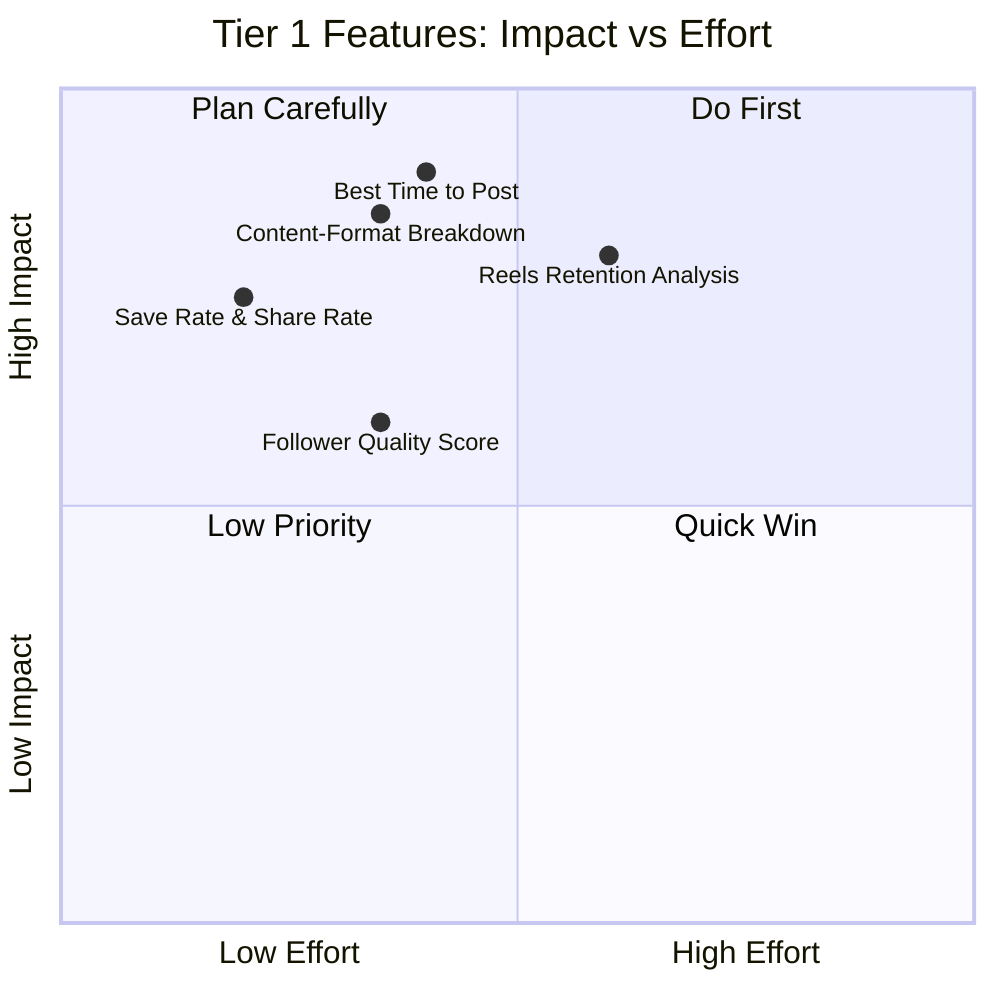

# Tier 1 Features — Facebook Graph API Research Report (Part 2)

> Continuation covering Features 4–5, the full modification checklist, API reference table, and implementation plan.

---

## Feature 4: Reels Retention & Drop-Off Analysis

### What It Does
Lets creators compare hook strength, completion rates, and replay behavior across their Reels — answering "which of my hooks are actually working?"

### Graph API Requirements

You already fetch two critical Reels-only metrics:

| Metric | What It Returns | Currently Collected? |
|--------|----------------|---------------------|
| `ig_reels_avg_watch_time` | Average seconds spent playing the reel | ✅ Yes |
| `ig_reels_video_view_total_time` | Total milliseconds the reel was played (incl. replays) | ✅ Yes |
| `reach` | Unique accounts that saw the reel | ✅ Yes |
| `views` | Number of times the reel was played | ✅ Yes |

### GAP: Missing `video_duration`

> [!CAUTION]
> **Critical missing data:** To compute **completion rate** (`avg_watch_time / video_duration`), you need the video's duration. This field is **NOT currently fetched or stored.**

The IG Media object does **not** expose a dedicated `duration` field in the Graph API. However, you can derive it:

**Option A — Compute from existing data:**
```
estimated_duration = ig_reels_video_view_total_time / views
```
This gives total watch time ÷ total plays = approximate duration IF there were no drop-offs. Not reliable.

**Option B — Fetch `video_duration` as part of media fields (Recommended):**

The Graph API **does** expose a `video_duration` field on VIDEO type IG Media (available for v21.0+, not listed in the main fields doc but accessible). However, this field is **not officially documented** for all media types and may not be available.

**Option C — Store client-side or user-input duration:**
Let users tag Reel duration manually, or infer from `media_url` metadata during sync.

### NEW Metric Available: `reels_skip_rate`

> [!IMPORTANT]
> **Meta added `reels_skip_rate` to the IG Media Insights API.** This is exactly the "hook strength" metric you want.
>
> **Definition:** "The percentage of views from people who skipped during the first 3 seconds of the reel."
>
> **Status:** "Metric is estimated and in development" — available for REELS only.
>
> **You are NOT currently collecting this metric.**

### Required Modification to `constants.py`

```diff
 MEDIA_REELS_METRICS: str = (
     "likes,comments,saved,shares,reach,views,total_interactions,"
-    "ig_reels_avg_watch_time,ig_reels_video_view_total_time,reposts"
+    "ig_reels_avg_watch_time,ig_reels_video_view_total_time,reposts,"
+    "reels_skip_rate"
 )
```

### Implementation: ClickHouse Queries

```sql
-- REELS RETENTION: Completion rate & hook strength per Reel
SELECT
    m.ig_media_id,
    m.permalink,
    m.caption,
    m.timestamp,
    metrics.avg_watch_time,
    metrics.total_view_time,
    metrics.reach,
    metrics.views,
    metrics.skip_rate,
    -- Completion rate proxy (higher = better retention)
    if(metrics.views > 0,
        metrics.total_view_time / metrics.views / 1000,  -- avg seconds per view
        0
    ) AS estimated_avg_duration,
    -- Hook strength = inverse of skip rate
    if(metrics.skip_rate > 0, 100 - metrics.skip_rate, 100) AS hook_strength_pct,
    -- Replay rate proxy = (total_view_time / avg_watch_time / reach) - 1
    if(metrics.reach > 0 AND metrics.avg_watch_time > 0,
        (metrics.total_view_time / 1000 / metrics.avg_watch_time / metrics.reach) - 1,
        0
    ) AS estimated_replay_rate
FROM instagram_media m FINAL
INNER JOIN (
    SELECT ig_media_id, user_id,
        sumIf(metric_value, metric_name = 'ig_reels_avg_watch_time') AS avg_watch_time,
        sumIf(metric_value, metric_name = 'ig_reels_video_view_total_time') AS total_view_time,
        sumIf(metric_value, metric_name = 'reach') AS reach,
        sumIf(metric_value, metric_name = 'views') AS views,
        sumIf(metric_value, metric_name = 'reels_skip_rate') AS skip_rate
    FROM media_insights FINAL
    WHERE user_id = {user_id:UUID}
    GROUP BY ig_media_id, user_id
) metrics ON m.ig_media_id = metrics.ig_media_id AND m.user_id = metrics.user_id
WHERE m.user_id = {user_id:UUID}
  AND m.media_product_type = 'REELS'
  AND m.timestamp >= {since:DateTime}
ORDER BY hook_strength_pct DESC
```

```sql
-- REELS TREND: Average hook strength over time (weekly buckets)
SELECT
    toStartOfWeek(m.timestamp) AS week,
    count(DISTINCT m.ig_media_id) AS reels_count,
    avg(100 - metrics.skip_rate) AS avg_hook_strength,
    avg(metrics.avg_watch_time) AS avg_watch_time
FROM instagram_media m FINAL
INNER JOIN (
    SELECT ig_media_id, user_id,
        sumIf(metric_value, metric_name = 'reels_skip_rate') AS skip_rate,
        sumIf(metric_value, metric_name = 'ig_reels_avg_watch_time') AS avg_watch_time
    FROM media_insights FINAL
    WHERE user_id = {user_id:UUID}
    GROUP BY ig_media_id, user_id
) metrics ON m.ig_media_id = metrics.ig_media_id AND m.user_id = metrics.user_id
WHERE m.user_id = {user_id:UUID}
  AND m.media_product_type = 'REELS'
  AND m.timestamp >= {since:DateTime}
GROUP BY week
ORDER BY week
```

### New Backend Endpoints

```
GET /api/instagram/insights/reels-retention?days=90&sort_by=hook_strength
GET /api/instagram/insights/reels-retention/trend?days=180&bucket=week
```

### Schema Changes Required
None for DB (metrics go into existing `media_insights` table).

### API Modifications Required

| File | Change |
|------|--------|
| [constants.py](file:///c:/laragon/www/social-analytics/backend/app/constants.py#L63) | Add `reels_skip_rate` to `MEDIA_REELS_METRICS` |

### Deprecated Metrics Warning

> [!WARNING]
> The following Reels metrics are **deprecated as of v22.0** and will stop working for all versions after April 21, 2025:
> - `plays` → replaced by `views`
> - `clips_replays_count` → no direct replacement
> - `ig_reels_aggregated_all_plays_count` → replaced by `views`
>
> Your codebase does **not** use these deprecated metrics. ✅

---

## Feature 5: Follower Quality Score

### What It Does
Computes the ratio between engaged audience and followers per demographic cohort, revealing which follower segments are active vs dormant.

### Graph API Requirements

> [!TIP]
> **No new API calls needed.** You already fetch both `follower_demographics` and `engaged_audience_demographics` with breakdowns for `age`, `gender`, `city`, and `country`.

Your current demographics sync in [router.py](file:///c:/laragon/www/social-analytics/backend/app/instagram/router.py#L269) already iterates:
```python
for metric_name in ACCOUNT_DEMOGRAPHIC_METRICS:       # ["follower_demographics", "engaged_audience_demographics"]
    for breakdown in ["age", "gender", "city", "country"]:
        total_value = await service.fetch_demographics(ig_user_id, token, metric_name, breakdown)
```

The API call uses:
```
GET /{ig_user_id}/insights
  ?metric=follower_demographics  (or engaged_audience_demographics)
  &period=lifetime
  &timeframe=this_month
  &metric_type=total_value
  &breakdown=age  (or gender, city, country)
```

### Available Timeframes

| Timeframe | Description |
|-----------|-------------|
| `this_week` | Last 7 days |
| `this_month` | Last 30 days |
| ~~`last_14_days`~~ | **Deprecated from v20.0+** |
| ~~`last_30_days`~~ | **Deprecated from v20.0+** |
| ~~`last_90_days`~~ | **Deprecated from v20.0+** |
| ~~`prev_month`~~ | **Deprecated from v20.0+** |

> [!NOTE]
> You currently only sync with `timeframe=this_month`. Consider also fetching `this_week` for more granular quality tracking.

### Minimum Requirements
- `follower_demographics`: Account must have 100+ followers
- `engaged_audience_demographics`: Account must have 100+ engagements in the timeframe

### Implementation: ClickHouse Queries

```sql
-- FOLLOWER QUALITY: Compare engaged vs follower demographics per cohort
SELECT
    f.dimension_key,
    f.dimension_value,
    f.metric_value AS follower_count,
    coalesce(e.metric_value, 0) AS engaged_count,
    if(f.metric_value > 0,
        round(coalesce(e.metric_value, 0) / f.metric_value * 100, 1),
        0
    ) AS engagement_rate_pct,
    -- Quality classification
    multiIf(
        engagement_rate_pct >= 50, 'HIGH',
        engagement_rate_pct >= 20, 'MEDIUM',
        engagement_rate_pct >= 5,  'LOW',
        'DORMANT'
    ) AS quality_tier
FROM demographic_insights f FINAL
LEFT JOIN demographic_insights e FINAL
    ON f.user_id = e.user_id
    AND f.ig_user_id = e.ig_user_id
    AND f.dimension_key = e.dimension_key
    AND f.dimension_value = e.dimension_value
    AND e.metric_name = 'engaged_audience_demographics'
WHERE f.user_id = {user_id:UUID}
  AND f.ig_user_id = {ig_user_id:String}
  AND f.metric_name = 'follower_demographics'
  AND f.dimension_key = {breakdown:String}
ORDER BY engagement_rate_pct DESC
```

```sql
-- FOLLOWER QUALITY SUMMARY: Overall quality score
SELECT
    sum(f.metric_value) AS total_followers_tracked,
    sum(coalesce(e.metric_value, 0)) AS total_engaged_tracked,
    if(total_followers_tracked > 0,
        round(total_engaged_tracked / total_followers_tracked * 100, 1),
        0
    ) AS overall_quality_pct,
    countIf(engagement_rate_pct >= 50) AS high_quality_cohorts,
    countIf(engagement_rate_pct < 5) AS dormant_cohorts
FROM (
    SELECT
        f.dimension_value,
        f.metric_value,
        coalesce(e.metric_value, 0) AS engaged_value,
        if(f.metric_value > 0, coalesce(e.metric_value, 0) / f.metric_value * 100, 0) AS engagement_rate_pct
    FROM demographic_insights f FINAL
    LEFT JOIN demographic_insights e FINAL
        ON f.user_id = e.user_id AND f.ig_user_id = e.ig_user_id
        AND f.dimension_key = e.dimension_key AND f.dimension_value = e.dimension_value
        AND e.metric_name = 'engaged_audience_demographics'
    WHERE f.user_id = {user_id:UUID}
      AND f.ig_user_id = {ig_user_id:String}
      AND f.metric_name = 'follower_demographics'
      AND f.dimension_key = {breakdown:String}
)
```

### Spike Detection Query

```sql
-- SPIKE DETECTION: Flag days with big follower growth but low engagement
SELECT
    ai.end_time AS spike_date,
    ai.metric_value AS follows_change,
    coalesce(ei.metric_value, 0) AS interactions,
    if(abs(ai.metric_value) > 0,
        coalesce(ei.metric_value, 0) / abs(ai.metric_value),
        0
    ) AS interaction_per_follow_ratio,
    -- Flag suspicious if big follow spike with very low engagement
    if(ai.metric_value > {spike_threshold:Int64}
       AND interaction_per_follow_ratio < 1.0, 1, 0) AS suspicious
FROM account_insights ai FINAL
LEFT JOIN account_insights ei FINAL
    ON ai.user_id = ei.user_id AND ai.ig_user_id = ei.ig_user_id
    AND ai.end_time = ei.end_time AND ei.metric_name = 'total_interactions'
WHERE ai.user_id = {user_id:UUID}
  AND ai.ig_user_id = {ig_user_id:String}
  AND ai.metric_name = 'follows_and_unfollows'
  AND ai.end_time >= {since:DateTime}
ORDER BY ai.end_time DESC
```

### New Backend Endpoints

```
GET /api/instagram/insights/follower-quality?breakdown=age
GET /api/instagram/insights/follower-quality/summary
GET /api/instagram/insights/follower-quality/spikes?days=90&threshold=50
```

### API Modifications Required
None — all data already collected.

---

## Complete Modification Checklist

### Files Requiring Changes

| File | Change | Feature |
|------|--------|---------|
| [constants.py](file:///c:/laragon/www/social-analytics/backend/app/constants.py) | Add `reels_skip_rate` to `MEDIA_REELS_METRICS` | #4 Reels Retention |
| [constants.py](file:///c:/laragon/www/social-analytics/backend/app/constants.py) | Add `saves,shares` to batch request metrics | #3 Save/Share Rate |
| [service.py](file:///c:/laragon/www/social-analytics/backend/app/instagram/service.py#L387) | Update batch URL to include `saves,shares` | #3 Save/Share Rate |
| [queries.py](file:///c:/laragon/www/social-analytics/backend/app/models/queries.py) | Add 8–10 new SQL queries | All features |
| [schemas.py](file:///c:/laragon/www/social-analytics/backend/app/instagram/schemas.py) | Add new Pydantic response models | All features |
| [router.py](file:///c:/laragon/www/social-analytics/backend/app/instagram/router.py) | Add 6–8 new GET endpoints | All features |
| New: `insights_service.py` | Business logic for computations | All features |

### New ClickHouse Migrations Required
None mandatory. Optional:
- Add `timezone` to `users` table (for Best Time feature)

### OAuth Scope Changes Required
None — existing scopes (`instagram_basic`, `instagram_manage_insights`, `pages_read_engagement`) are sufficient for all Tier 1 features.

---

## Complete Graph API Endpoint Reference

| API Endpoint | Method | What You Use It For | Currently Used? |
|-------------|--------|-------------------|-----------------|
| `GET /{ig_user_id}/insights` | `metric=reach, period=day, metric_type=time_series` | Account reach time-series | ✅ Yes |
| `GET /{ig_user_id}/insights` | `metric=views, period=day, metric_type=total_value` | Account views total | ✅ Yes |
| `GET /{ig_user_id}/insights` | `metric=follows_and_unfollows,total_interactions,accounts_engaged, period=day, metric_type=total_value` | Batch daily metrics | ✅ Yes (batch) |
| `GET /{ig_user_id}/insights` | `metric=saves,shares, period=day, metric_type=total_value` | Account save/share counts | ❌ **ADD THIS** |
| `GET /{ig_user_id}/insights` | `metric=follower_demographics, period=lifetime, timeframe=this_month, breakdown=age\|gender\|city\|country` | Follower demographics | ✅ Yes |
| `GET /{ig_user_id}/insights` | `metric=engaged_audience_demographics, period=lifetime, timeframe=this_month, breakdown=age\|gender\|city\|country` | Engaged audience demographics | ✅ Yes |
| `GET /{media_id}/insights` | `metric=likes,comments,saved,shares,reach,views,total_interactions,profile_visits,reposts` | Feed post insights | ✅ Yes |
| `GET /{media_id}/insights` | `metric=likes,comments,saved,shares,reach,views,total_interactions,ig_reels_avg_watch_time,ig_reels_video_view_total_time,reposts` | Reels insights | ✅ Yes |
| `GET /{media_id}/insights` | `metric=reels_skip_rate` | Reels hook strength | ❌ **ADD THIS** |
| `GET /{ig_user_id}/media` | `fields=id,media_type,media_product_type,media_url,...` | Media list | ✅ Yes |

---

## Risk Assessment & Deprecation Warnings

> [!WARNING]
> ### API Version Risk
> You are using **v21.0**. The latest version is **v25.0**. Key deprecation impacts:
>
> - **`impressions`** — Deprecated for v22.0+, deprecated for ALL versions after April 21, 2025. You do **not** use this metric. ✅ Safe.
> - **`plays`, `clips_replays_count`, `ig_reels_aggregated_all_plays_count`** — Deprecated for v22.0+. You do **not** use these. ✅ Safe.
> - **`video_views`** — Already deprecated. You do **not** use this. ✅ Safe.
> - **Demographics timeframes** `last_14_days`, `last_30_days`, `last_90_days`, `prev_month` — Deprecated from v20.0+. You use `this_month`. ✅ Safe.
>
> **Recommendation:** Upgrade to v22.0 or later at your convenience. Your current metric selections are forward-compatible.

> [!NOTE]
> ### Metrics in Development
> Several metrics you rely on carry Meta's "in development" or "estimated" labels:
> - `views` (account + media level) — "in development"
> - `ig_reels_video_view_total_time` — "in development"
> - `reels_skip_rate` — "estimated and in development"
> - `reach` — "estimated"
> - `accounts_engaged` — "estimated"
>
> These are stable enough for production use but may see definition changes in future API versions.

---

## Implementation Priority Matrix



### Recommended Build Order

| Order | Feature | Effort | Dependencies |
|-------|---------|--------|-------------|
| 1 | Save Rate & Share Rate | ~2 days | Minor: add metrics to sync |
| 2 | Content-Format Breakdown | ~3 days | None |
| 3 | Best Time to Post | ~4 days | Optional: timezone field |
| 4 | Follower Quality Score | ~3 days | None |
| 5 | Reels Retention & Drop-Off | ~5 days | Add `reels_skip_rate` to sync |

### Total estimated effort: ~17 days (~3.5 weeks)

---

## Summary of Required Code Changes

### Minimal changes (2 lines in `constants.py`, 1 line in `service.py`):

```diff
# constants.py

 MEDIA_REELS_METRICS: str = (
     "likes,comments,saved,shares,reach,views,total_interactions,"
-    "ig_reels_avg_watch_time,ig_reels_video_view_total_time,reposts"
+    "ig_reels_avg_watch_time,ig_reels_video_view_total_time,reposts,"
+    "reels_skip_rate"
 )
```

```diff
# service.py line 387 (batch request URL)

-rel_url = f"{ig_user_id}/insights?metric=follows_and_unfollows,total_interactions,accounts_engaged&period=day&metric_type=total_value&since={int(current_dt.timestamp())}&until={int(next_dt.timestamp())}"
+rel_url = f"{ig_user_id}/insights?metric=follows_and_unfollows,total_interactions,accounts_engaged,saves,shares&period=day&metric_type=total_value&since={int(current_dt.timestamp())}&until={int(next_dt.timestamp())}"
```

### New files to create:
- `queries.py` — Add ~10 new SQL query constants
- `schemas.py` — Add ~6 new Pydantic response models
- `router.py` — Add ~8 new GET endpoint handlers
- `insights_service.py` (new) — Business logic layer for Tier 1 computations

Everything else is pure ClickHouse computation on data you already have.
