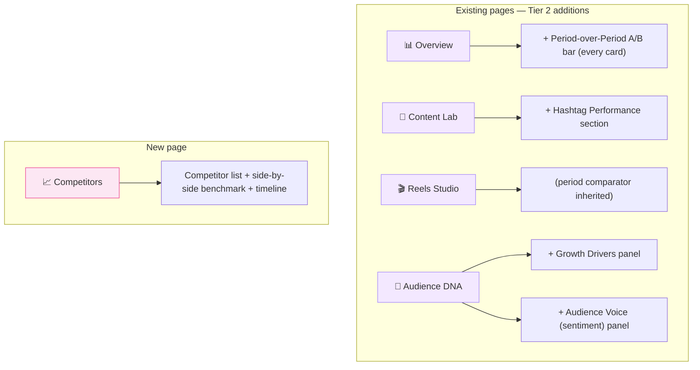

# Tier 2 Implementation Plan — Overview & Master Index

> **Companion docs (one per feature):**
> - `tier2_period_over_period.md` — A/B period comparator across all pages
> - `tier2_audience_growth_drivers.md` — post → follower attribution
> - `tier2_hashtag_performance.md` — per-account hashtag analytics
> - `tier2_comment_sentiment.md` — comments sync + sentiment + topic clustering
> - `tier2_competitor_benchmarking.md` — public competitor handle tracking

This master plan covers cross-cutting decisions: information architecture, shared infrastructure, dependencies, and build order. Each feature plan is self-contained and can be implemented by a single engineer in roughly the order listed here.

---

## Where Tier 2 Lives in the IA

Tier 1 established four pages (Overview, Content Lab, Reels Studio, Audience DNA). Tier 2 extends those pages plus adds **one net-new top-level page** (Competitors).



| Existing page | What's added | Feature |
|---------------|--------------|---------|
| Overview | Period A/B comparator, sparklines on every card | F1 |
| Audience DNA | Growth Drivers panel (extends SpikeTimeline) | F5 |
| Audience DNA | Audience Voice panel (sentiment + topics) | F4 |
| Content Lab | Hashtag Performance section (3 new components) | F2 |
| All four pages | Inherits period comparator from F1 | F1 |
| **New** `/dashboard/competitors` | Competitor benchmarking, full page | F3 |

### Sidebar update

Add one entry for Competitors. Update `src/components/DashboardSidebar.jsx`:

```jsx
import { BarChart3, FlaskConical, Film, Users, LineChart } from "lucide-react";

const NAV_ITEMS = [
  { to: "/dashboard",            icon: BarChart3,    label: "Overview" },
  { to: "/dashboard/content",    icon: FlaskConical, label: "Content Lab" },
  { to: "/dashboard/reels",      icon: Film,         label: "Reels Studio" },
  { to: "/dashboard/audience",   icon: Users,        label: "Audience DNA" },
  { to: "/dashboard/competitors",icon: LineChart,    label: "Competitors" },
];
```

---

## Shared Infrastructure (build once, reuse across features)

### S.1 — PeriodComparatorContext (used by F1 + inherited everywhere)

A single React context that holds the active comparison: `{ periodA: { days, from, to }, periodB: { days, from, to } | null }`. Mounted at `DashboardLayout` so every page inside sees the same comparison state.

```jsx
// src/context/PeriodComparatorContext.jsx
import { createContext, useContext, useState, useMemo } from "react";

const Ctx = createContext(null);

export function PeriodComparatorProvider({ children }) {
  const [days, setDays] = useState(30);
  const [compareMode, setCompareMode] = useState(null);
  // null | "prev_period" | "prev_year" | "custom"

  const value = useMemo(() => ({ days, setDays, compareMode, setCompareMode }), [days, compareMode]);
  return <Ctx.Provider value={value}>{children}</Ctx.Provider>;
}

export const usePeriodComparator = () => useContext(Ctx);
```

Wrap `DashboardLayout`'s `<main>` with `<PeriodComparatorProvider>`. All existing `useState(days)` calls inside child pages get replaced with `const { days } = usePeriodComparator()`.

Full design in `tier2_period_over_period.md`.

### S.2 — useFetch enhancement: support `null` URL for conditional fetching

Already in `useTier1Insights.js`. No change needed — features F2/F3/F4 use the same pattern.

### S.3 — Stats helper module

```js
// src/utils/stats.js
export function pctDelta(current, prior) {
  if (prior === 0 || prior == null) return current === 0 ? 0 : Infinity;
  return ((current - prior) / prior) * 100;
}

// Welch's t-test for "is this delta significant?" — used by F1
export function welchsTTest(meanA, varA, nA, meanB, varB, nB) {
  if (nA < 3 || nB < 3) return { significant: false, reason: "small_sample" };
  const seDiff = Math.sqrt(varA / nA + varB / nB);
  const t = Math.abs(meanA - meanB) / seDiff;
  // 95% two-tailed critical value ~1.96 for large n; conservative threshold
  return { significant: t > 2.0, t };
}
```

### S.4 — Shared `Badge` and `Trend` primitives

Tier 2 introduces enough badges (sentiment chips, hashtag pills, competitor tier badges, attribution confidence) that we should extract a single `<Badge>` component.

```jsx
// src/components/shared/Badge.jsx
const PALETTE = {
  emerald: "bg-emerald-50 text-emerald-700 border-emerald-200",
  amber:   "bg-amber-50 text-amber-700 border-amber-200",
  rose:    "bg-rose-50 text-rose-700 border-rose-200",
  slate:   "bg-slate-50 text-slate-700 border-slate-200",
  violet:  "bg-violet-50 text-violet-700 border-violet-200",
  pink:    "bg-pink-50 text-pink-700 border-pink-200",
};
export default function Badge({ color = "slate", icon: Icon, children, className = "" }) {
  return (
    <span className={`inline-flex items-center gap-1 px-2 py-0.5 rounded-full text-[10px] font-semibold uppercase tracking-wider border ${PALETTE[color]} ${className}`}>
      {Icon && <Icon size={10} />}
      {children}
    </span>
  );
}
```

---

## NPM Dependencies

Tier 2 stays mostly within the existing stack. New packages:

| Package | Used by | Notes |
|---------|---------|-------|
| `@anthropic-ai/sdk` | F4 (comment sentiment) | Server-side only. Already part of the BE if Claude is being used elsewhere; else add to `backend/requirements.txt` as `anthropic`. |
| `date-fns` | F1 (period math) | Recharts already pulls a small date util, but for "this month vs last month" + "same month last year" we want consistent timezone-aware boundaries. Lightweight (~7 KB gzipped). |

Everything else (Recharts, framer-motion, lucide-react, axios) is reused.

---

## Backend Migrations Needed

Each feature plan documents its own schema. Summary here so the migration sequence is clear:

| Migration | Feature | Tables / Changes |
|-----------|---------|------------------|
| `008_create_post_hashtags.sql` | F2 | New denormalized table for hashtag extraction |
| `009_create_instagram_comments.sql` | F4 | Comments sync |
| `010_create_comment_sentiment.sql` | F4 | Per-comment sentiment + embedding |
| `011_create_comment_topics.sql` | F4 | Cluster metadata |
| `012_create_competitor_handles.sql` | F3 | User-added competitor handles |
| `013_create_competitor_snapshots.sql` | F3 | Daily public snapshot per handle |

All use `ReplacingMergeTree` matching the existing convention.

---

## Build Order (recommended)

Ordered for compounding leverage — each feature reuses what came before.

| # | Feature | Effort | Reason |
|---|---------|--------|--------|
| F1 | **Period-over-Period** | 1 week | Build the shared comparator context first. Every other Tier 2 card gains "vs previous period" automatically once it exists. |
| F5 | **Audience Growth Drivers** | 1 week | Small. Extends existing SpikeTimeline. Closes the loop on Tier 1 follower-quality work. |
| F2 | **Hashtag Performance** | 1 week | Pure SQL on stored captions. No new sync pipeline. |
| F4 | **Comment Sentiment** | 2 weeks | First feature requiring a comments sync + LLM batch job. Sets up the comment data layer that future AI features (Tier 4) will reuse. |
| F3 | **Competitor Benchmarking** | 3 weeks | Largest. New ingestion pipeline + new top-level page. Build last so the cohort of users running it is largest. |

**Total:** ~8 weeks of single-engineer effort. Each feature can ship independently.

---

## Cross-Feature Decisions

### How comparisons interact with feature-specific data

When the global period comparator is set to "vs prev period," every Tier 2 component (hashtags, growth drivers, sentiment trend, competitor timeline) should also respect it. This means each feature's hooks must accept a `compareTo: { from, to } | null` parameter. The feature plans below all include this hook signature.

### Backend query parameter convention

All Tier 2 endpoints accept:

| Param | Type | Default | Used by |
|-------|------|---------|---------|
| `days` | int | 30 | All |
| `compare_to` | `prev_period` \| `prev_year` \| ISO date range | (none) | F1, inherited |
| `breakdown` | enum | (per-endpoint) | F2, F4, F5 |

Pydantic Settings already supports this pattern via `Query(...)` on each route.

### Permission scopes

| Feature | Existing IG scope sufficient? | Notes |
|---------|------------------------------|-------|
| F1 | ✅ | Pure SQL on existing data |
| F5 | ✅ | Same |
| F2 | ✅ | Caption already stored |
| F4 | ⚠️ | Requires `instagram_business_manage_comments` — **already in `REQUIRED_INSTAGRAM_SCOPES`** in `constants.py`, so existing OAuth tokens work |
| F3 | ⚠️ | Public Business account read — **does not require new user-level scopes**, but Meta app review may be required at scale |

---

## Master Checklist

### Shared / infrastructure (build first)

| # | Task | File | Status |
|---|------|------|--------|
| S.1 | PeriodComparatorContext + provider | `context/PeriodComparatorContext.jsx` | ⬜ |
| S.2 | Mount provider in DashboardLayout | `components/DashboardLayout.jsx` | ⬜ |
| S.3 | stats.js helper (pctDelta, t-test) | `utils/stats.js` | ⬜ |
| S.4 | Badge primitive | `components/shared/Badge.jsx` | ⬜ |
| S.5 | Add Competitors route + sidebar entry | `App.jsx`, `DashboardSidebar.jsx` | ⬜ |

### Per-feature checklists

See each `tier2_*.md` plan for the feature-specific checklist.

---

## What this plan does NOT cover

These belong to later tiers (the roadmap doc explains why):

- **Tier 3 — Monetization** (Media Kit, Rate Card, Brand-Deal Tracking, UTM Attribution) → separate `tier3_*` plans
- **Tier 4 — AI Advisor Layer** (Weekly Digest, Idea Generator, Post Diagnostic, Caption A/B) → separate `tier4_*` plans
- **Cross-platform** (YouTube, TikTok, Threads) → out of scope until Tiers 2–4 land

---

## Implementation Order

```
S.1 – S.5 (shared infrastructure, ~3 days)
    ↓
tier2_period_over_period.md           (F1, 1 week)
    ↓
tier2_audience_growth_drivers.md      (F5, 1 week)
    ↓
tier2_hashtag_performance.md          (F2, 1 week)
    ↓
tier2_comment_sentiment.md            (F4, 2 weeks)
    ↓
tier2_competitor_benchmarking.md      (F3, 3 weeks)
```

**Total Tier 2 effort:** ~8 weeks single-engineer.
